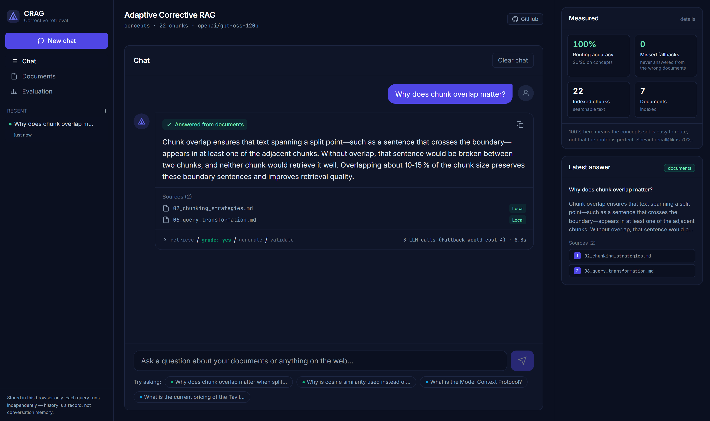
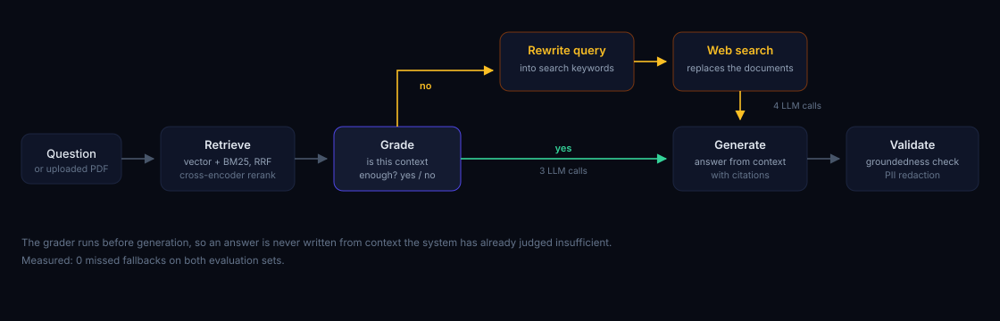

<div align="center">

# Adaptive Corrective RAG

RAG that grades its own retrieval before answering, and searches the web only when the documents fall short.

[](https://github.com/Nitishjha7/adaptive-crag/actions/workflows/ci.yml)
[](#what-the-numbers-say)
[](backend/eval/RESULTS.md)
[](backend/app/graph/build_graph.py)
[](LICENSE)

**[Live demo](https://adaptive-crag-906520260355.asia-south1.run.app)**

</div>



---

## Why I built it

A vector database always returns something. Ask it a question it has no answer
to and you still get the four nearest chunks back, because "nearest" is the only
thing it knows — there is no score below which it says *I don't have this*.

The model then writes a confident wrong answer from those chunks and cites them.
The citations make it look more trustworthy, not less. That is what bothered me:
not that RAG gets things wrong, but that it gets them wrong **with sources
attached**.

So this checks whether the retrieved context is good enough before it generates
anything, and goes to the web when it is not.

---

## What it does

Ask a question and it retrieves, grades what came back, and only then answers.
On `no` it rewrites the query and searches the web instead. Drop in a PDF and it
answers from that.

The correction path is measured: **0 missed fallbacks** on both evaluation sets.
That is the expensive error — answering locally when it should have gone to the
web — and it never happened.

It is also tested against a benchmark, not only my own labels. On the
hand-written set routing scores 100%; on SciFact, where the labels ship with the
dataset, the same router scores 78.6% and over-triggers six times. The second
number is the one worth trusting.

---

## Quick start

```bash
git clone https://github.com/Nitishjha7/adaptive-crag && cd adaptive-crag
copy .env.example .env      # add GROQ_API_KEY
docker compose up --build
```

UI on `:3001`, API docs on `:8001/docs`. Tests need no API key: `.\dev.ps1 test`.

---

## What the numbers say

| | concepts | SciFact |
|---|---|---|
| Who wrote the labels | the author | the dataset (`qrels`) |
| Routing accuracy | 100% (20/20) | **78.6%** (22/28) |
| Missed fallbacks | 0 | 0 |
| Unnecessary fallbacks | 0 | **6** |
| Retrieval recall@k | no ground truth | **70%** |
| Groundedness | 90% | 92.9% |

On `concepts` the author wrote both the documents and the labels, and what is
missing from them is an obvious category — so 100% means the task is easy, not
that the router is good. SciFact removes that bias, and there the router
over-triggers: six unnecessary fallbacks, one extra LLM call each. **That is the
real failure mode, and only the second set could show it.**

Two experiments came back flat and are reported anyway: reranking changed
retrieval on 27 of 28 questions without moving a single routing verdict, and the
latency comparison turned out to be an artifact of test ordering, so no latency
figure is quoted. Full analysis in [backend/eval/RESULTS.md](backend/eval/RESULTS.md).

---

## How it works



1. **Retrieve** — vector search and BM25 over Chroma, fused with Reciprocal Rank
   Fusion, reranked by a local cross-encoder. They fail differently: vectors miss
   exact tokens, BM25 misses paraphrases.
2. **Grade** — a binary LLM verdict on whether the retrieved context is worth
   answering from. Binary because a score needs a threshold, and a threshold is
   another number with no data behind it.
3. **Correct** — on `no`, the query is rewritten into search keywords and the web
   replaces the rejected documents.
4. **Generate** — answers strictly from the surviving context, with citations.
5. **Validate** — independent groundedness check and regex PII redaction.

Questions are answered from the built-in documents, or from a PDF uploaded at
runtime — parsed, chunked and indexed into a session-scoped collection so one
visitor's document never answers another's question.

| Layer | Technology |
|---|---|
| Orchestration | LangGraph `StateGraph`, conditional edges |
| LLM | Groq `gpt-oss-120b`, `with_fallbacks` to `20b` |
| Embeddings | FastEmbed `bge-small-en-v1.5`, local ONNX |
| Retrieval | Chroma + BM25, RRF, `ms-marco-MiniLM` cross-encoder |
| Web fallback | DuckDuckGo · Tavily optional |
| Deploy | Cloud Run, single image serving API and SPA |


---

## Choices I had to make

| Choice | Reason |
|---|---|
| **Binary grader**, not a 0–1 score | A score needs a threshold, and the threshold would be another number picked without data. Binary is also checkable against a label. |
| Parse **`no` before `yes`** | An explanation can contain both words. The safe reading of a confused answer is `no` — one extra web call, not a hallucination. |
| **Hybrid retrieval**, fused by rank | Vectors miss exact tokens, BM25 misses paraphrases. RRF (`k=60`) combines rankings, so the two never need comparable score scales. |
| Fallback **replaces** documents | `documents` is the one state field with no reducer. Appending web results would leave rejected context in the prompt. |
| Corpus in a **`ContextVar`** | Which index to read is a property of the request, not the process. Uploads reuse it — `upload:<session>` is just another corpus name. |
| **Session-scoped uploads** | One shared index on a public demo means one visitor's PDF answers another's question. |
| Determinism from the **prompt** | The grader once returned `yes` and `no` for identical input. `temperature=0` is no guarantee on a MoE model and Groq ignores `seed` — the fix was a criterion with one reading. |

---

## Deployment

Deployed on **Google Cloud Run** — one container serving the API and the built
SPA from a single origin, so there is no CORS to configure and one service to
keep alive. Scales to zero when idle, and Cloud Build redeploys on every push to
`main`. The embedding model, the cross-encoder and the index are baked into the
image at build time, so the first request never waits on a download.

Sizing and the failures it took are in [DEPLOYMENT.md](docs/DEPLOYMENT.md).

---

## Docs

| | |
|---|---|
| **[PROJECT_WALKTHROUGH.md](docs/PROJECT_WALKTHROUGH.md)** | **Start here.** How a question flows through the graph |
| [RESULTS.md](backend/eval/RESULTS.md) | Every measurement, including the negative ones |
| [TECHNICAL_SPEC.md](docs/TECHNICAL_SPEC.md) · [CODE_NOTES.md](docs/CODE_NOTES.md) | Architecture, state schema, file-by-file notes |
| [DEPLOYMENT.md](docs/DEPLOYMENT.md) | Cloud Run sizing, and the failures it took |
| [ROADMAP.md](docs/ROADMAP.md) · [SETUP.md](docs/SETUP.md) | What was built when; local setup |

---

**133 tests**, no API key required. CI builds the index the same way the deploy
image does, then boots that image and checks it serves.

---

<div align="center">

MIT · [Nitish Jha](https://github.com/Nitishjha7)

</div>
