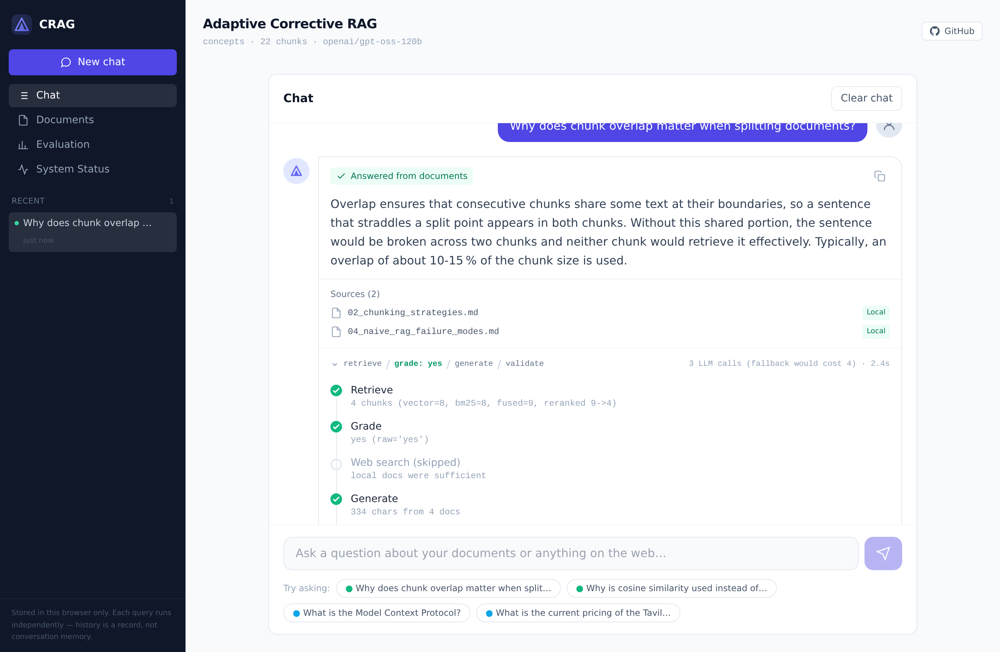
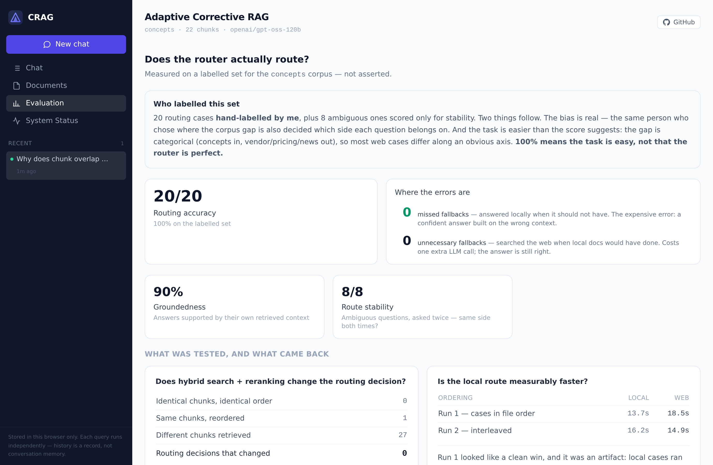
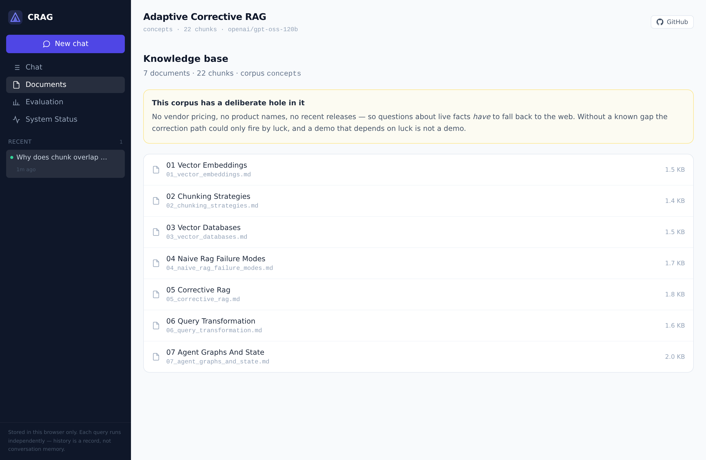
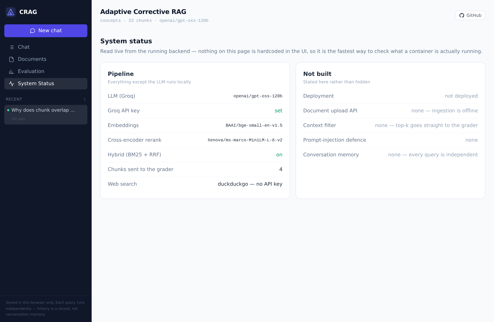

# Adaptive Corrective RAG (CRAG) with Web Search Fallback

An agentic RAG system built with LangGraph that self-grades retrieved documents,
rewrites ambiguous queries, and falls back to live web search when local context is
insufficient — eliminating hallucinations from stale or irrelevant vector-store hits.

Naive RAG blindly trusts whatever the vector DB returns. CRAG adds a verification loop:
a grading node decides whether the retrieved chunks actually answer the question, and only
falls back to the web when they don't — so you get grounded answers without paying the
cost and latency of a web call on every query.

## What it looks like

Every answer carries its own execution trace, collapsed to one line and
expandable. This is the local route — note that **Web search is shown as
skipped**, which is the whole point: the fallback is conditional, not the
default. The LLM call count is read from the trace, and the local path names the
cost of the path it did not take.



The evaluation page leads with **who labelled the test set**, because "measured
on a labelled set" invites exactly one question. Below it, two experiments with
their real tables — including the one where reranking changed 27 of 28 retrievals
and moved zero routing decisions.



<details>
<summary>Documents and System Status</summary>

The indexed corpus, with the deliberate gap stated above the list — the grader's
verdict is only legible if you can see what it was grading.



Live configuration read from the running backend, and an explicit list of what
was **not** built.



</details>

> ## Status: full stack works; measured; not deployed
>
> The corrective loop, the API and the UI are implemented and **verified against the
> real Groq API and live DuckDuckGo search** — `docker compose up` gives a working
> system. Routing is now **measured, not asserted**: 20 labelled queries, 20/20
> correct, 0 missed fallbacks ([results](backend/eval/RESULTS.md)).
>
> | Piece | State |
> |---|---|
> | Phase 1 — Chroma ingestion, config, controlled corpus | ✅ 7 docs → 22 chunks |
> | Phase 2 — `CRAGState`, LangGraph skeleton | ✅ |
> | Phase 3 — grading, conditional edge, query transform, web fallback | ✅ both routes verified live |
> | Phase 4 — groundedness + PII validation | ✅ |
> | Phase 5 — FastAPI `/api/query` + `/health` | ✅ |
> | Phase 6 — React dashboard (chat, citations, inline trace, documents + evaluation + system views) | ✅ |
> | Phase 7 — `docker-compose.yml` (backend + Nginx frontend, `/api/` proxy) | ✅ |
> | Citations — source filenames (local) / URLs (web) | ✅ |
> | Hybrid retrieval (BM25 + RRF) + cross-encoder rerank | ✅ A/B'd on both corpora — flat on concepts, **+1 case on SciFact** |
> | Second corpus — BEIR SciFact (`CORPUS=scifact`) | ✅ 500 docs → 1,717 chunks, labels from qrels |
> | Test suite — 75 tests (`.\dev.ps1 test`) | ✅ |
> | Evaluation harness — 20 labelled + 8 ambiguous (`.\dev.ps1 eval`) | ✅ **routing 20/20 · ambiguous stability 8/8** |
> | Answer correctness — SciFact SUPPORT/CONTRADICT labels | 🟡 baseline **83.3%** (90.9% given gold retrieved); A/B half-run |
> | Deployment (HuggingFace Space) | ❌ not done — Render free measured and ruled out |

## Measured: does the router actually route?

`backend/eval/` turns "routing looked right on the demo queries" into a number —
20 labelled questions, each marked for whether the local corpus genuinely answers it.

| Metric | Result |
|---|---|
| Routing accuracy | **20/20 (100%)**, stable across 3 runs |
| — on the 5 deliberately misleading cases | 5/5 |
| **Missed fallbacks** (answered locally when it should have searched) | **0** |
| Unnecessary fallbacks | 0 |
| Groundedness pass rate | 90–95% |
| **LLM calls per query** | **local 3.0 · web 4.0** |
| **Ambiguous cases** — 8 half-covered questions, 3 runs each | **8/8 stable · split 4 local / 4 web** |

Four things worth saying out loud, because the numbers alone flatter the system:

- **100% means the labelled task is easy, not that the router is perfect.** The
  corpus gap is categorical by design — concepts in, vendor/pricing/news out — so
  most web cases differ along an obvious axis. Eight **ambiguous** cases were added
  for the harder situation, where the corpus half-covers the topic. They are scored
  for *stability*, not correctness, because their labels are genuinely contestable
  and an arguable label would make the headline number undefendable.
- **Stable is not the same as coherent.** All 8 were stable across 3 runs — but #25
  ("does the 10-15% overlap guidance apply to source code?") went web while #28
  ("is 800 characters right for legal contracts?") went local, and those are the same
  question shape. The grader applies *a* rule reliably, not demonstrably a consistent
  one. That is the more useful finding — and it is what gave the retrieval work below
  something to be measured against, since routing accuracy cannot move from 100%.
- **The cost argument rests on call counts, not latency.** Correction costs one
  extra LLM call (+33%) and one web round trip, only on queries that need it.
  Latency was tried first and **failed as a measurement** — Groq's throttling
  swamps the route difference, and the first ordering produced a confounded
  result that looked convincing. That story is in RESULTS.md; it is the more
  useful half of this eval.
- **Hybrid search and reranking made no measurable difference *here* — reported, not
  buried.** A/B'd behind flags: routing 100% → 100%, stability 8/8 → 8/8, every ambiguous
  case unchanged. The flags were not no-ops — **27 of 28 questions retrieved different
  chunks**. The retrieval changed a lot; the decision changed not at all. On a 22-chunk
  topically-clustered corpus the verdict follows topic, not ranking, and `grade_documents`
  concatenates the chunks so it never sees the ordering a reranker optimises. The honest
  conclusion was *"this eval cannot show a benefit"*, not *"there is none"* — and the
  next section tests exactly that on a corpus that can.

The exit code fails when missed fallbacks exceed the threshold, so a prompt or
model change that quietly breaks routing fails the way a test does.

### On a harder corpus, the numbers stop being pinned

The 100% above is the ceiling problem: nothing can improve a metric already at 100%.
Re-running the same 28 cases against **BEIR SciFact** (1,717 chunks, labels from the
dataset's own `qrels`) gives the eval room to move — and adds **recall@k**, which the
concepts corpus cannot support because it has no ground truth about which chunk is right.

| Metric | Baseline (vector only) | Hybrid + rerank |
|---|---|---|
| Routing accuracy | 75.0% | **78.6%** |
| Retrieval recall@k | 65.0% | **70.0%** |
| Missed fallbacks | **0** | **0** |

Two things to take from this, in order of importance:

- **The grader made zero independent errors.** On the baseline run every case where the
  gold document *was* retrieved routed correctly (13/13), and every case where it was
  *missed* fell back to the web (7/7). All seven "routing failures" were retrieval
  misses the grader detected correctly. 75% understates the grader — conditional on
  what it received, it was right 20/20. **The bottleneck here is retrieval, not grading.**
- **The improvement is one case, and is reported as one case.** +5pp recall on 20
  gold-bearing cases is a single document (#10, `MISS → gold`, route `web → local`).
  That is inside noise. What it does establish is the causal chain — better retrieval →
  gold found → correct route — which was unobservable before. Claiming reranking *works*
  needs the full 5k corpus and 300-query test set; that needs more RAM than this laptop
  gives Docker.

### Was the answer actually right?

Everything above measures the *route*. Groundedness is the only answer-level
check, and it asks something narrower than it sounds: whether the answer matches
the context it was handed. **An answer built from the wrong documents passes it.**

SciFact is a claim-verification dataset, so it records whether the gold abstract
**supports** or **contradicts** each claim. Twelve of the twenty local cases carry
that label — the dataset's, not mine.

| | Baseline (vector only) |
|---|---|
| Answer correct, end to end | **83.3%** (10 / 12) |
| Answer correct, **given the gold document was retrieved** | **90.9%** (10 / 11) |
| Took no position at all | 1 |

The two failures are different animals. In one the gold document was never
retrieved and the system **declined to reach a verdict** rather than inventing
one — scored wrong, but the right behaviour on missing evidence. In the other it
had the right document and still drew the opposite conclusion: the single genuine
generator error in the run.

Which extends the finding above one stage further down the pipeline. The grader
made zero independent errors; given the right document, the generator was right
ten times out of eleven. Both remaining failures trace back to the same place.

This is deliberately **not LLM-as-judge**. A judge is asked "is this good?",
which is a model's opinion wearing a number's clothes. Here the model is asked
only what position the text takes; right and wrong come from the dataset. The
extraction is still the weakest link, and
[RESULTS.md](backend/eval/RESULTS.md) says so.

**The A/B on this metric has not run.** The treatment arm hit Groq's daily token
cap partway through, so only the baseline exists and nothing anywhere compares
the two. Whether reranking improves *answers* is still an open question — which
is the honest state of it.

## Tech Stack

| Layer | Technology |
|---|---|
| Agent orchestration | LangGraph (StateGraph) — conditional branching, corrective loops |
| LLM & embeddings | LangChain + Groq / FastEmbed / HuggingFace |
| Local knowledge base | ChromaDB, embedded mode (cosine similarity) |
| Retrieval | Vector (Chroma) + BM25, fused with RRF, then cross-encoder rerank |
| Web search fallback | DuckDuckGo (default, no key) / Tavily (optional, `SEARCH_PROVIDER=tavily`) |
| Output validation | Custom LLM groundedness check + regex PII redaction |
| Backend | FastAPI (async ASGI) |
| Frontend | React + Vite + Tailwind CSS |
| Containerization | Docker & Docker Compose |

## How it works

1. **`retrieve`** — vector search + BM25 over ChromaDB, fused by RRF, reranked by a local
   cross-encoder down to the top-k chunks.
2. **`grade_documents`** — an LLM binary grader scores whether the retrieved context is
   relevant/sufficient (`"yes"` / `"no"`).
3. **Relevant →** straight to `generate`.
4. **Not relevant →** `transform_query` rewrites the question into search-optimized
   keywords → `web_search_fallback` pulls fresh snippets → `generate`.
5. **`generate`** — synthesizes an answer grounded strictly in the verified context.
6. **`validate_guardrails`** — final scan: an independent LLM groundedness check plus PII
   redaction, before the answer is returned with a source badge (Local DB vs Web Fallback).

**Start here: [docs/PROJECT_WALKTHROUGH.md](docs/PROJECT_WALKTHROUGH.md)** — the flowchart,
how it was built step by step, and how the whole system runs. If you read one file, read
that one.

See [docs/TECHNICAL_SPEC.md](docs/TECHNICAL_SPEC.md) for the full architecture, state
schema, node contracts, and reference implementation. See
[docs/INTERVIEW_NOTES.md](docs/INTERVIEW_NOTES.md) for the pitch, USP deep-dives,
trade-offs, and anticipated Q&A. See [docs/RAG_FUNDAMENTALS.md](docs/RAG_FUNDAMENTALS.md)
for general RAG concepts, a production-RAG question bank, and an honest map of which
pipeline stages this project has and which it deliberately does not. And
[docs/CODE_QA.md](docs/CODE_QA.md) is 27 questions with answers about the code
itself — why the grader is binary, why `no` is parsed before `yes`, why the
fallback replaces documents instead of merging them.

## Project Structure

```
backend/    FastAPI app, LangGraph state machine, nodes, tools, guardrails
frontend/   React + Vite + Tailwind client (chat UI, source badges, trace viewer)
docs/       Walkthrough (start here), code Q&A, technical spec, code notes,
            interview notes, RAG fundamentals, setup, build plan, roadmap
```

## Setup

See [docs/SETUP.md](docs/SETUP.md) for the full git/repo setup steps that were actually run.

Only `GROQ_API_KEY` is required — web search defaults to DuckDuckGo, which needs no key.

```bash
cp .env.example .env       # fill in GROQ_API_KEY
docker compose up --build
```

- Frontend → <http://localhost:3001>
- Backend docs → <http://localhost:8001/docs>

Ports are 3001/8001 rather than 3000/8000 because other projects on this machine hold
those; override with `FRONTEND_PORT` / `BACKEND_PORT` in `.env`.

**Switching corpus** — the whole stack, UI included, runs on either corpus:

```bash
CORPUS=scifact docker compose up -d --build   # BEIR SciFact, 1,717 chunks
docker compose up -d                          # back to concepts
```

Everything corpus-specific follows: the demo questions, the evaluation findings, the
"who labelled this set" note, and the corpus note on the Documents page. That is
deliberate — the SciFact numbers next to prose written about the concepts corpus would
have the dashboard contradicting its own figures.

**First run:** the Chroma index is built into the image at `backend/vectorstore`, but if
it's empty, populate it with `.\dev.ps1 ingest`.

### Backend-only dev loop

`dev.ps1` runs everything in the backend container with the source bind-mounted, so edits
don't need a rebuild:

```powershell
.\dev.ps1 build              # only when requirements.txt changes
.\dev.ps1 ingest [-Reset]    # embed backend/data/ into Chroma
.\dev.ps1 ask "why does chunk overlap matter?"
.\dev.ps1 test               # 60 tests, no API key needed
.\dev.ps1 eval               # 20 labelled cases (real LLM + live web calls)
.\dev.ps1 eval --repeat 3    # + 8 ambiguous cases, scored for route stability
.\dev.ps1 eval --limit 6     # smoke run, saves rate limit
.\dev.ps1 serve -Port 8042   # FastAPI alone
```

### The second corpus

`CORPUS` selects what is indexed. The two are not alternatives — see
[backend/eval/CORPORA.md](backend/eval/CORPORA.md) for what each can and cannot claim.

```powershell
.\dev.ps1 ingest -Corpus scifact -Reset --limit 1200   # BEIR SciFact
.\dev.ps1 ask   -Corpus scifact "..."
.\dev.ps1 eval  -Corpus scifact --scenarios eval/scenarios_scifact.json
```

`concepts` (default, 7 hand-written docs) gives a **predictable demo** — the gap is
categorical, so the correction path fires on cue. `scifact` gives **measurable
retrieval**: BEIR ships expert relevance judgments, so the `local` eval labels are not
written by me, and `recall@k` — did the gold document actually get retrieved — becomes
possible at all. Each corpus lives in its own Chroma collection; switching needs no
re-ingest.

## Build Plan

See [docs/BUILD_PLAN.md](docs/BUILD_PLAN.md) — session-wise schedule, who does what, timeline.

## Roadmap

See [docs/ROADMAP.md](docs/ROADMAP.md). Short version:

- **Phase 1** — Vector store ingestion + Chroma persistence + config
- **Phase 2** — LangGraph skeleton: `CRAGState`, nodes, conditional edges
- **Phase 3** — Grading + `transform_query` + web-search fallback
- **Phase 4** — Output validation layer (groundedness + PII)
- **Phase 5** — FastAPI `/api/query` endpoint with step logs
- **Phase 6** — React + Vite + Tailwind demo UI (source badges, trace viewer)
- **Phase 7** — Docker Compose + deployment
- **Phase 8** — Routing eval harness (`backend/eval/`) — ✅ done, [results](backend/eval/RESULTS.md)

## Planned extensions

**None of the following is built.** They are ranked by whether they strengthen the thesis
of this project — *measure the corrective loop, then improve it* — rather than by how well
they demo.

### Worth building next

**Evaluation dashboard.** Render `backend/eval/` output in the UI: routing accuracy, missed
vs unnecessary fallbacks, groundedness rate, LLM calls per route. The data already exists as
JSON, so this is presentation rather than new measurement — and it puts the honest caveats
from [RESULTS.md](backend/eval/RESULTS.md) on screen next to the numbers, where they belong.

**Knowledge base manager.** Upload, delete and re-index documents from the UI, with chunk
count and last-indexed time. The reason this beats the other UI ideas: it makes the corpus
gap *manipulable live*. An interviewer can add a document about a topic that currently
routes to the web, re-index, ask the same question, and watch the route flip to local. That
demonstrates the grading loop far better than any static badge.

**Feedback loop.** 👍/👎 plus a reason (`wrong source`, `not grounded`, `outdated`),
persisted, and convertible into new labelled eval cases. This closes the loop the eval
harness opens — real disagreements become the ambiguous test cases the current 20-case set
admits it lacks.

### Needs a design decision first

**Multi-source answers (local + web combined).** This **contradicts a documented decision**:
on fallback the pipeline deliberately *replaces* local documents rather than merging them,
because they were just graded irrelevant and keeping them dilutes the context — see
[docs/CODE_NOTES.md](docs/CODE_NOTES.md). Merging isn't wrong, but it can't be bolted on:
it needs the binary grader to become three-way (fully / partially / not relevant) so
"partially relevant" is an actual state. Ship the three-way grader first, re-run the eval,
then merge — otherwise it silently reintroduces the failure mode the grading step exists to
remove.

**Confidence score.** A single `Confidence: 92%` is only as honest as its inputs, and today
those inputs are two binaries (`grade: yes/no`, `grounded: yes/no`). Combining them into a
two-decimal percentage invents precision that isn't there, and an interviewer who asks "why
92 and not 85?" would get no real answer. It becomes defensible only on top of continuous
signal the pipeline doesn't yet surface — retrieval distances (already available via
`similarity_search_with_scores`), grader token logprobs, snippet agreement.

### Partly redundant with what exists

**Cost & performance analytics.** LLM calls per query is *already* the headline cost metric
(local 3.0 · web 4.0), and token usage plus estimated cost are an easy addition since Groq
returns usage on every response. But the latency half needs care: latency was already tried
as an eval metric and **failed** — Groq's throttling swamps the route difference so badly
that the measured local route (15.7s) came out *slower* than the web route (14.9s), which is
backwards. A latency panel would put that unreliable number on screen looking authoritative,
so label it indicative, not measured.

**Source quality scoring** (relevance · freshness · authority). Relevance and groundedness
are already computed. Freshness and authority need metadata the pipeline doesn't collect —
DuckDuckGo gives a URL and a snippet, no publication date — so this means a date-extraction
step and a domain-authority heuristic, both of which are guesses worth labelling as guesses.

**Query intelligence.** The rewritten query is already surfaced in the UI, and the trace
already shows why the fallback fired. The genuinely new part is *local coverage* — and that
one is real, because retrieval distances are already available and would give an honest
"how close was the local corpus" number instead of a synthesised one.

## Positioning

Part of an **"Agentic Self-Correcting Systems"** portfolio theme alongside the
Self-Healing SQL Agent — same architectural pattern (LLM + self-verification +
autonomous correction), applied to a different domain (retrieval relevance vs
SQL execution errors).
