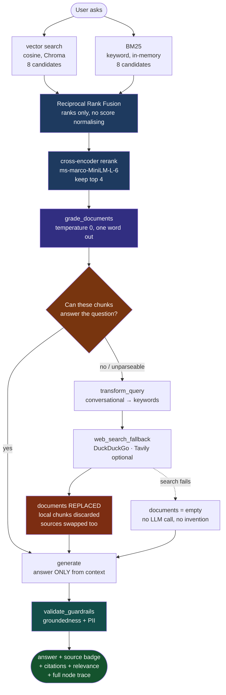
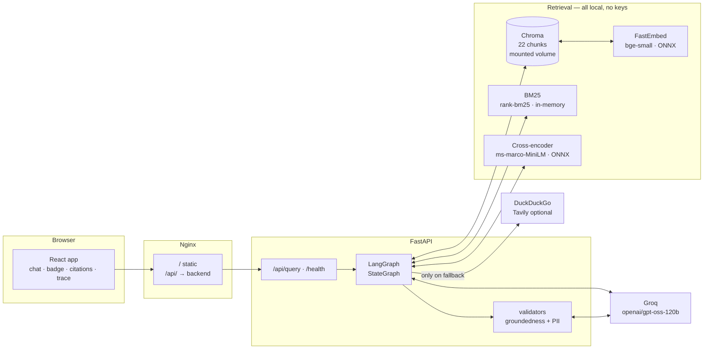

# Project Walkthrough — what was built, how, and how it works

This is the whole project **in one place**: the flowchart, what each step does and why,
and at the end how the complete system runs. If you only read one file, read this one.

What the other docs are for:
[TECHNICAL_SPEC](TECHNICAL_SPEC.md) architecture and design decisions ·
[CODE_NOTES](CODE_NOTES.md) file-by-file "why this exists" ·
[INTERVIEW_NOTES](INTERVIEW_NOTES.md) the pitch and Q&A ·
[RAG_FUNDAMENTALS](RAG_FUNDAMENTALS.md) general RAG concepts and question bank ·
[eval/RESULTS](../backend/eval/RESULTS.md) measured numbers ·
[ROADMAP](ROADMAP.md) what is left.

---

## 1. In one line

A question → retrieve from a local vector store → **an LLM grades whether those chunks
can actually answer it** → if yes, answer locally; if no, the agent rewrites the query,
searches the live web, and answers from that instead → then a second, independent check
that the answer is grounded in whatever context survived.

Naive RAG has one assumption: whatever came back from the vector store is relevant.
Similarity search always returns *k* results, even when the corpus contains nothing
useful — and the low score never reaches the model. **Here, that assumption is a
decision the system makes out loud, and can be measured.**

---

## 2. The full journey of one question (flowchart)



**The blue boxes are the retrieval half** — hybrid search and reranking, added last
(Step 11) precisely because they could not be justified before the eval could measure them.

**The orange diamond is the whole project.** Everything else is ordinary RAG. That one
runtime decision — taken *before* any answer is generated — is what separates this from
a pipeline that confidently answers from irrelevant chunks.

**The red box is the decision people get wrong.** On fallback the local documents are
**replaced, not merged**. They were just graded "not relevant"; keeping them dilutes the
good web context and re-introduces the exact failure the grading step exists to remove.
There is a test asserting this, because it is the kind of thing that breaks silently.

---

## 3. How it was built — step by step

### Step 1 — A corpus with a hole in it, on purpose

Seven Markdown documents on RAG/agent engineering concepts → 22 chunks
(800 chars, 100 overlap, `RecursiveCharacterTextSplitter` with `\n## ` as the first
separator so splits land on headings).

The important part is what is **deliberately absent**: no vendor pricing, no product
names, no recent releases, no mention of MCP. Without a known gap the correction path
can only be triggered by luck, and a demo that depends on luck is not a demo.

The gap is *categorical* — concepts in, live facts out — and that choice comes back to
bite in Step 6.

### Step 2 — Config as factories, not imports

`get_llm()`, `get_embeddings()`, `get_vectorstore()`, each `@lru_cache`d. Heavy imports
live *inside* the functions so importing a module doesn't drag in ONNX runtimes.

This looked like over-engineering until the first test run: every LLM node could be
swapped for a scripted fake in one line, which is why 60 tests run with no API key.

### Step 3 — The state, and one reducer decision

`CRAGState` is a `TypedDict`. Two fields behave differently on purpose:

- `logs` — **additive reducer** (`Annotated[List[str], operator.add]`). Every node
  appends one line and no node needs to know what ran before it. The trace assembles
  itself.
- `documents` — **plain overwrite, no reducer.** This is the deliberate one. An additive
  reducer here would mean rejected local chunks stay in context alongside web snippets.

Same for `sources`, added later with citations: it must be replaced on fallback, or the
UI cites local files under a web-sourced answer and sends the user to the wrong place.

### Step 4 — The graph, and why it is a graph

```
START → retrieve → grade_documents → (conditional) → generate → validate_guardrails → END
                                   ↘ transform_query → web_search_fallback ↗
```

`decide_to_generate` is deliberately trivial — it only reads `relevance_score`. All the
judgement lives in `grade_documents`, so routing and grading can be tested separately.

Its default is `transform_query`, not `generate`: if the score is somehow blank, the safe
direction is to pay for a web call, not to answer from unverified context.

Both branches merge back into **one** `generate`. It reads only `state["documents"]` and
cannot tell where they came from, so there is one prompt to maintain, not two.

### Step 5 — Grading, and parsing it defensively

A temperature-0 call with a prompt that says: answer with one word, do not explain.

`parse_verdict` still checks `no` before `yes`, and treats anything unrecognisable as
`no`. The reasoning: in a confused output the safe default is a wasted web call, never a
missed one. Eleven cases cover it.

Temperature 0 is not about answer quality here — it is so the same question takes the
same route twice. A router that flips is impossible to demo and impossible to debug.

### Step 6 — Measuring it, which is where it got interesting

20 labelled questions, each marked for whether the corpus genuinely answers it, labels
written from corpus coverage *before* the first run.

Result: **20/20, 0 missed fallbacks, stable across three runs.** Which is a suspicious
number, and RESULTS.md says so: the corpus gap is categorical by design, so most web
cases differ along an obvious axis. 100% means *the labelled task is easy*.

Two things this step produced that matter more than the score:

**The ordering bug.** The first run went 12 local cases, then 8 web. Groq's throttling
ramps up over a run, so the web bucket absorbed all of it — and the resulting
"local 13.7s vs web 18.5s" looked like a clean cost argument while measuring nothing but
position. Cases are now interleaved.

**Latency was abandoned as a metric.** Even interleaved, throttling swamps the route
difference — one run measured the *local* route slower than the web route, which is
backwards. The cost argument now rests on **LLM calls per query (local 3.0 · web 4.0)**,
which comes from graph structure, not from timing, and is identical on every run.

### Step 7 — Validation, without the library

The plan called for Guardrails AI. It was dropped: hub downloads and version pinning were
going to be the largest time sink in the build, and what was actually needed was two
things — is this answer supported by the context, and does it leak PII.

The first is one temperature-0 call reusing the same `parse_verdict`. The second is four
regexes, deliberately *not* an LLM, because PII detection should be deterministic.

Two behaviours worth defending:

- An **ungrounded answer is flagged, not blocked.** Seeing a hallucination get caught is
  more convincing than seeing it vanish, and "this may be wrong" beats a blank screen.
  **PII is the opposite** — it is redacted, because flagging a leak is still a leak.
- The groundedness check **fails open.** If the check itself errors, the answer still
  ships with a note in the trace. It was built from already-verified context; failing
  closed would let one flaky network call turn the system into "I can't tell you anything."

### Step 8 — The API and the UI

`POST /api/query` returns the answer plus `source_type`, `sources`, `relevance_score`,
`transformed_query`, `logs`, `elapsed_ms`. The graph compiles once in `lifespan`, and
`graph.invoke` runs in a threadpool — it is sync and blocking, and calling it directly in
an `async def` would stall the event loop.

`/health` deliberately makes **no LLM call**: if it did, one rate-limit would mark the
container unhealthy and Docker would restart it in a loop.

The UI is a dashboard, not just a chat box: a nav rail, four stat cards, the conversation,
and a right rail carrying the trace, the live system config, and the evaluation numbers.
`GET /api/stats` feeds it — corpus counts from disk, chunk count from Chroma, routing
numbers read out of `eval/results.json`. Like `/health` it makes no LLM call, because the
dashboard hits it on every page load.

**The rule the UI is built on: nothing on screen is a number the backend cannot produce.**
Three consequences, and they are the interesting part:

- **No "Relevance Score: 0.92".** The grader returns one word. Turning that into a
  two-decimal percentage invents precision that does not exist, and "why 92 and not 85?"
  would have no answer. The panel shows `Relevance Verdict: yes`.
- **No per-step timestamps in the trace.** The backend does not emit per-node timing, so
  printing `10:24:03` next to each step would be fabrication. Total `elapsed_ms` is real
  and is shown.
- **"Web Search (Skipped)" is displayed on purpose.** On the local route that node never
  ran — showing it greyed out is what makes the fallback visibly *conditional* rather than
  a default, which is the whole thesis in one glance.

The Evaluation tab prints the caveat directly under the numbers: 100% means the labelled
task is easy, not that the router is perfect. A dashboard that contradicts its own
RESULTS.md would be worse than no dashboard.

### Step 9 — Citations

The `source` filename was in chunk metadata from day one and simply never read. Getting
it to the UI meant a new `sources` field rather than changing `documents` to a list of
dicts — that would have broken `generate`'s contract of not knowing where context came
from.

Web URLs were already embedded in snippet text as `[source: ...]` so the model could cite
inline; those are now also parsed out into the structured list. The duplication is
intentional: the inline copy is for the LLM, the list is for the UI.

### Step 10 — Making the eval able to fail

The 20-case set could no longer improve — it was pinned at 100%. So a reranker or hybrid
search could be *added* but never *justified*.

Eight **ambiguous** cases were added: questions where the corpus half-covers the topic and
two reasonable people would label differently. *"How does Self-RAG differ from CRAG?"* —
doc 05 mentions Self-RAG in exactly one clause.

They are **not scored for correctness**, because an arguable label would make the headline
number undefendable — the very reason they were excluded originally. They are scored for
**stability**: run the same question three times and check the router picks the same side
every time. Which side is a judgement call; flipping on identical input is not.

Adding them immediately exposed a bug: `interleave()` bucketed only `local` and `web` and
silently dropped everything else, so all 8 cases vanished with no error. It now asserts
that no case is lost.

---

### Step 11 — Hybrid retrieval and reranking, once they could be measured

This step was deliberately held back until Step 10 existed. Routing accuracy was at
100% and could not move, so adding a reranker would have produced a longer feature list
and no evidence. **The ambiguity tier had to come first so there was a number that could
respond.**

Three pieces, all local and key-free, matching the rest of the stack:

**BM25** (`app/tools/bm25_search.py`) — keyword scoring over the same 22 chunks. Vector
search is strong on meaning and weak on exact tokens: `EMP-4582` and `EMP-4583` sit almost
on top of each other in embedding space because they *mean* the same thing. BM25 is the
opposite. The index is built from the whole collection because IDF depends on
corpus-wide term frequency — running BM25 over only the top-k would compute nonsense.

**Reciprocal Rank Fusion** (`app/tools/reranker.py`) — merges the two ranked lists with
`1 / (60 + rank)`. Chosen because it reads **ranks, not scores**: Chroma returns cosine
*distance* (lower is better) and BM25 returns an unbounded positive score (higher is
better). Normalising those into a common scale is corpus-specific tuning and brittle. RRF
sidesteps the problem entirely.

**Cross-encoder rerank** — `Xenova/ms-marco-MiniLM-L-6-v2`, 80 MB ONNX, shipped inside
`fastembed`, so no new dependency and no API key.

The retriever is a **bi-encoder**: query and document are embedded separately, which is
why it is fast — document vectors are precomputed — but it never sees the two together. A
**cross-encoder** feeds the pair through the model jointly, which is far more accurate and
far too expensive to run over a whole corpus. Hence the two-step shape: the cheap retriever
proposes 8, the expensive reranker picks 4.

**Why a reranker helps *this* project specifically** — and this is the part worth saying
out loud: it is not about answer quality. `grade_documents` decides whether local context
is sufficient. If the right chunk was retrieved but sat fourth, the grader may never
effectively see it and can return a wrong "no". **The reranker's real job here is to
improve the grader's input.**

Both stages sit behind `USE_HYBRID` and `USE_RERANKER`, defaulting on. The flags exist so
the eval can run the same 44 cases with them off and compare — a feature whose benefit
cannot be shown is not a feature in this project.

**And the comparison came back negative.** Routing 100% → 100%. Ambiguous stability
8/8 → 8/8. Every ambiguous case took the *same* route in both configurations.

The flags were not no-ops: **27 of 28 questions retrieved a different set of chunks.** The
retrieval changed substantially; the decision did not change at all.

Why, and this is the part worth understanding: the corpus is 22 chunks and topically
clustered, so any reasonable retriever lands in the right document — the grader reads
"this is about chunking" either way. On top of that, `grade_documents` **concatenates**
all four chunks, so it never sees the ordering a reranker optimises. Reranking could only
change the verdict by changing membership across a topic boundary, which barely happens at
this scale.

The honest conclusion is not "reranking is useless" but "**this eval cannot show a benefit**" —
it measures routing, and reranking should help *answer* quality. Full write-up in
[RESULTS.md](../backend/eval/RESULTS.md).

---

## 4. How the whole system works now

### 4.1 Component map



Note what is **not** here: no separate vector-DB service (Chroma is embedded, persistence
is a mounted volume), and no embeddings API (FastEmbed runs in-process, so retrieval costs
no network call and no key).

### 4.2 The life of the state

| Field | Written by | Merge | Why that merge |
|---|---|---|---|
| `question` | caller | — | Never mutated; the rewrite goes elsewhere |
| `documents` | `retrieve`, then `web_search_fallback` | **overwrite** | Rejected chunks must not survive into the answer |
| `sources` | same two nodes | **overwrite** | Or a web answer cites local files |
| `relevance_score` | `grade_documents` | overwrite | The conditional edge reads only this |
| `source_type` | `retrieve` / `web_search_fallback` | overwrite | Drives the UI badge |
| `transformed_query` | `transform_query` | overwrite | Empty unless the fallback ran — which is itself the signal |
| `generation` | `generate` | overwrite | Raw, not yet validated |
| `final_output` | `validate_guardrails` | overwrite | What the user actually receives |
| `logs` | every node | **additive** | The trace builds itself; no node needs history |

### 4.3 What stops a wrong answer — three layers

| Layer | What it catches | Its limit |
|---|---|---|
| `grade_documents` | Irrelevant retrieval, *before* generation | It is itself an LLM and can be wrong. A false "yes" is the dangerous one |
| `generate` prompt | Model adding outside knowledge | A prompt is a request, not a guarantee |
| `validate_guardrails` | Claims not supported by context; PII | Fails open by design; not a prompt-injection defence |

**Not handled:** prompt injection through retrieved content — a real risk on the web path,
where the text is written by strangers. The groundedness check is a partial net (an
injected instruction usually produces an unsupported answer), but it was not designed for
this and should not be claimed as such.

### 4.4 What was verified

| | |
|---|---|
| **60 tests** (`.\dev.ps1 test`) | Both routes · docs-replace invariant · citations swap · search failure · `parse_verdict` · PII · fail-open · API shape · BM25 · RRF · reranker fallback · retrieval flags. No API key needed |
| **Routing eval** (`.\dev.ps1 eval`) | 20 labelled cases — 20/20, 0 missed fallbacks, 3 runs |
| **Ambiguity eval** (`--repeat 3`) | 8 half-covered cases, scored for route stability |
| **Retrieval A/B** | Same 44 cases with `USE_HYBRID`/`USE_RERANKER` off vs on — see [RESULTS](../backend/eval/RESULTS.md) |
| **Real runs** | Both routes against live Groq + live DuckDuckGo |
| **Full stack** | `docker compose up` → first query works (after the healthcheck fix) |

### 4.5 Bugs that only real runs found

None of these were caught by tests, which is the point.

| Bug | Why mocks missed it |
|---|---|
| `llama-3.3-70b-versatile` → 404 | The model was never available on this Groq account. A mocked LLM answers happily |
| `ingest.py --reset` → `Device or resource busy` | `vectorstore/` is a Docker mount point; `rmtree` cannot remove it |
| First query after `compose up` → 502 | `depends_on: service_started` let Nginx start before uvicorn bound the port |
| 8 eval cases silently vanished | `interleave()` dropped any label that wasn't `local`/`web` |
| A real API key reached a committed file | `.env.example` is tracked; `.env` is not. The key was pushed to a public repo and had to be revoked |

---

## 5. What is left

**Deployment.** No `render.yaml`, no `vercel.json`. CORS is still `allow_origins=["*"]`
and must be restricted to the frontend origin before it goes anywhere public.

**Context filter.** Hybrid search and reranking landed in Step 11, but there is still no
relevance threshold that drops weak chunks before they reach `generate` — the top 4 go
through regardless of how weak the fourth is.

**Document parsing.** The corpus is Markdown. No PDF, DOCX or HTML extraction, which in a
real system is where a surprising share of retrieval bugs originate.

**Corpus maintenance.** Documents are ingested once. No incremental update, no delete,
no re-index — a full re-ingest is the only path.

**Prompt-injection handling** on the web path.

---

## 6. Quick reference

### Commands

```powershell
docker compose up --build     # full stack → :3001 (UI) · :8001 (API docs)

.\dev.ps1 ingest [-Reset]     # backend/data/ → Chroma
.\dev.ps1 ask "..."           # one query, full trace, no server
.\dev.ps1 test                # 60 tests, no API key needed
.\dev.ps1 eval                # 20 labelled cases — real LLM + live web
.\dev.ps1 eval --repeat 3     # + 8 ambiguous cases, scored for stability
.\dev.ps1 serve -Port 8042    # API alone
```

### The files that matter most

| File | Why |
|---|---|
| `app/nodes/grade_documents.py` | The decision the whole project is about |
| `app/graph/build_graph.py` | `decide_to_generate` — the conditional edge |
| `app/nodes/web_search_fallback.py` | Replace-not-merge, and the failure path |
| `app/schemas/crag_state.py` | Which fields get a reducer, and why one does not |
| `app/guardrails/validators.py` | Flag vs redact; fail-open |
| `eval/scenarios.json` | The labels, and why each ambiguous case is arguable |
| `eval/RESULTS.md` | The measurement that failed — the most useful page here |

### Env vars that change behaviour

| Var | Default | Effect |
|---|---|---|
| `GROQ_API_KEY` | — | **Required.** Nothing runs without it |
| `SEARCH_PROVIDER` | `duckduckgo` | `tavily` for cleaner snippets (needs a key) |
| `LLM_MODEL` | `openai/gpt-oss-120b` | Grading, rewrite, generation, groundedness |
| `TOP_K` | `4` | Chunks retrieved, and web results requested |
| `FRONTEND_PORT` / `BACKEND_PORT` | `3001` / `8001` | Host ports |
